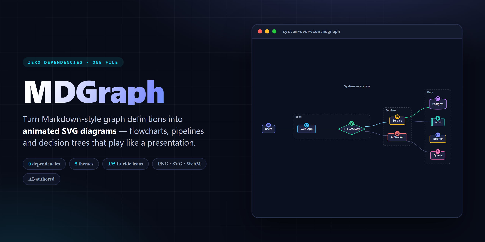
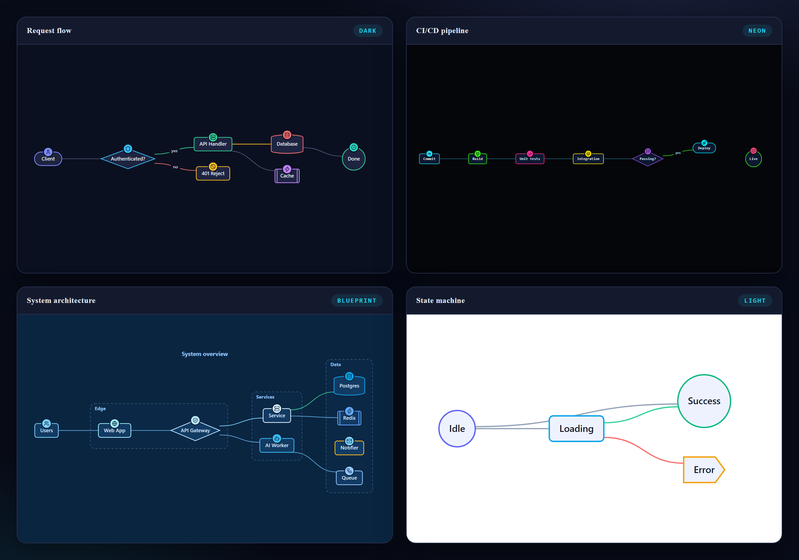
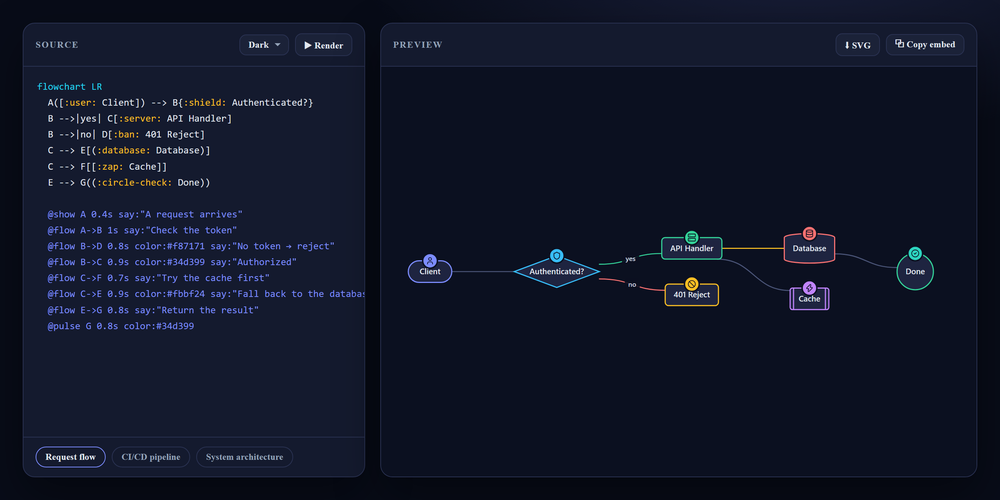
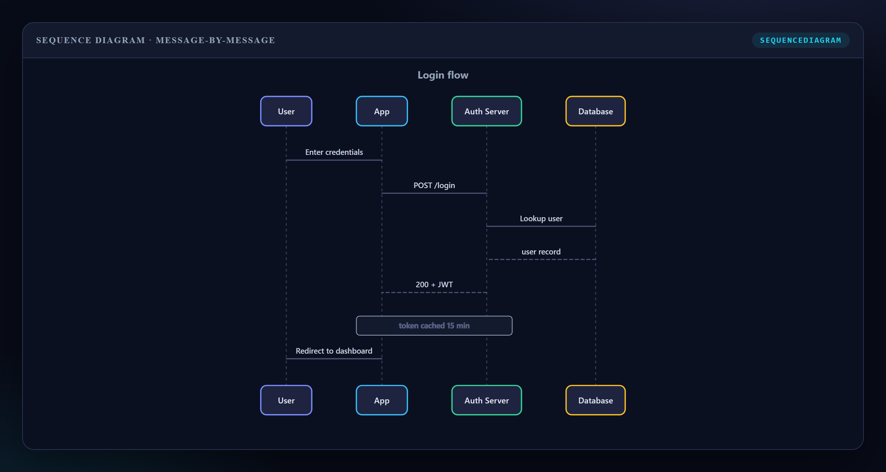

<div align="center">



<p>
  <a href="https://github.com/juanpe500/mdgraphs/actions/workflows/ci.yml"></a>
  <a href="LICENSE"></a>
  
  
  
</p>

<b>Standalone, zero-dependency JavaScript for animated Markdown-style diagrams.</b><br>
Turn a mermaid-flavoured graph definition into an <b>animated SVG</b> that plays like a presentation.

<a href="https://juanpe500.github.io/mdgraphs/"><b>▶ Live studio &amp; docs</b></a> ·
<a href="#quick-start">Quick start</a> ·
<a href="#diagram-syntax">Syntax</a> ·
<a href="#animation-directives">Directives</a>

</div>

---

MDGraph turns a Markdown/mermaid-flavoured graph definition into an **animated SVG** that plays like
a presentation — reveal nodes step by step, send glowing particles flowing along edges, pulse, focus,
recolor, and narrate each step with captions.

It's designed for a specific workflow: **an AI writes the diagram, MDGraph renders and animates it** —
for slide decks, docs, walkthroughs and explainers.

> One file. No build step. No dependencies. Drop in a `<script>` tag and go.

- 🌊 **Directional edge flow** — forward, backward, or bidirectional, with per-edge color and duration
- 🎬 **Step timeline** — play / pause / next / prev / scrub / speed, plus captions and keyboard control
- 🧩 **Automatic layout** — layered (Sugiyama-style) with crossing reduction; you never place a node
- 🎨 **5 themes + full overrides** — `dark`, `light`, `neon`, `blueprint`, `mono`
- 📐 **Rich shapes** — rectangle, rounded, stadium, circle, diamond, hexagon, cylinder, subroutine, flag
- 🏷️ **Category icons** — 195 [Lucide](https://lucide.dev) icons bundled inline; `:icon:` on any node
- 📊 **Tables** — Markdown pipe tables render alongside graphs and animate row by row
- 🗂️ **Subgraphs & sequence diagrams** — labeled clusters, plus `sequenceDiagram` with message-by-message animation
- 🔍 **Zoom, pan & export** — wheel/drag navigation; one-click **PNG / SVG / WebM** export
- 📽️ **Presentation mode** — fullscreen with big captions; play-on-scroll for docs; `prefers-reduced-motion` aware

---

## Gallery

One syntax, five themes, every shape and icon — all rendered by the same 118 KB file, no network requests.



**Write the graph on the left, watch it render and animate on the right** — that's the whole studio.
Every node, edge, icon and caption is driven by the plain-text definition.



Sequence diagrams too — start the source with `sequenceDiagram` and each message animates in order.



> Every image above is the library's **actual SVG output** — export any of them as PNG or SVG straight
> from the toolbar, or record the animation to WebM.

---

## Install

Load it straight from the jsDelivr CDN — nothing to build or install:

```html
<script src="https://cdn.jsdelivr.net/gh/juanpe500/mdgraphs@v1.1.0/mdgraph.js"></script>
```

…or copy the single `mdgraph.js` file into your project and use a relative path. Use
`@latest` instead of `@v1.1.0` to always track the newest version.

Or as an ES module / CommonJS:

```js
import MDGraph from './mdgraph.js';
// or
const MDGraph = require('./mdgraph.js');
```

---

## Quick start

```html
<div id="chart" style="height:420px"></div>
<script src="https://cdn.jsdelivr.net/gh/juanpe500/mdgraphs@v1.1.0/mdgraph.js"></script>
<script>
  const player = MDGraph.render('#chart', `
    flowchart LR
      A[Request] --> B{Auth?}
      B -->|yes| C[Handler]
      B -->|no|  D[Reject]
      C --> E[(Database)]

      @show A 0.4s
      @flow A->B 1s   say:"Incoming request"
      @flow B->C 1s   color:#34d399 say:"Authorized"
      @pulse E 0.8s   color:#fbbf24
  `, { theme: 'dark', autoplay: true });
</script>
```

### Auto-initialize from HTML

Any element with `data-mdgraph` (or `<pre class="mdgraph">`) is rendered automatically on
load — ideal for documentation pages:

```html
<pre class="mdgraph" data-theme="neon">
flowchart LR
  A[Commit] --> B[Build] --> C([Deploy])
  @flow A->B 0.8s
  @flow B->C 0.8s say:"Ship it"
</pre>
```

---

## Diagram syntax

A definition starts with a direction header, then one edge/node per line.

```
flowchart LR          # or TB / TD (top-down), BT (bottom-up), RL (right-left)
  A[Start] --> B{Choice}
  B -->|option 1| C(Do this)
  B -->|option 2| D(Do that)
```

### Node shapes

| Syntax        | Shape           | Syntax          | Shape        |
|---------------|-----------------|-----------------|--------------|
| `A[Text]`     | Rectangle       | `A((Text))`     | Circle       |
| `A(Text)`     | Rounded         | `A{Text}`       | Diamond      |
| `A([Text])`   | Stadium / pill  | `A{{Text}}`     | Hexagon      |
| `A[(Text)]`   | Cylinder / DB   | `A[[Text]]`     | Subroutine   |
| `A>Text]`     | Flag            |                 |              |

Declare a node once with a shape; reference it by id afterwards. Multi-word labels can be
quoted: `A["My label"]`.

### Category icons (Lucide, built in)

Prefix a node's label with `:icon-name:` to stamp a [Lucide](https://lucide.dev/icons/) icon on
it — a colored badge that reads as a *category*. **195 icons are bundled inline** (no network
requests, CSP-safe); the badge takes the node's accent color automatically.

```
flowchart LR
  A([:user: Client]) --> B{:shield: Auth?}
  B -->|yes| C[:server: API Handler]
  C --> D[(:database: Postgres)]
  C --> E[[:zap: Redis]]
```

| Option        | Values                         | Effect                                    |
|---------------|--------------------------------|-------------------------------------------|
| `iconPos`     | `'top'` (default) · `'inline'` | Badge on the top border, or glyph left of the label |
| `iconColor`   | any CSS color                  | Force one icon color (default = node accent) |

```js
MDGraph.render('#chart', src, { iconPos: 'inline' });

// bundled icon names, and add your own:
MDGraph.iconNames();                 // -> ['user','users','database', ...] (195)
MDGraph.hasIcon('rocket');           // -> true
MDGraph.registerIcons({
  myLogo: '<circle cx="12" cy="12" r="9"/><path d="M12 3v18"/>'  // inner SVG, 24x24 viewBox
});
```

Common bundled names: `user` `users` `server` `database` `cloud` `globe` `shield` `shield-check`
`lock` `key` `zap` `cpu` `code` `terminal` `git-branch` `workflow` `box` `package` `layers` `bell`
`mail` `send` `clock` `calendar` `file-text` `folder` `search` `filter` `activity` `chart-bar`
`gauge` `dollar-sign` `credit-card` `shopping-cart` `rocket` `bot` `brain` `sparkles` `flag`
`check-check` `bug` `wrench` `settings` `heart` `star` `map-pin` `house` `play` `download` `upload`
… full list via `MDGraph.iconNames()`. Unknown names are ignored gracefully.

### Edges

| Syntax            | Meaning                     |
|-------------------|-----------------------------|
| `A --> B`         | Arrow                       |
| `A --- B`         | Line, no arrowhead          |
| `A -.-> B`        | Dotted                      |
| `A ==> B`         | Thick                       |
| `A <--> B`        | Bidirectional               |
| `A -->|label| B`  | Labeled edge                |
| `A -- label --> B`| Labeled edge (middle form)  |
| `A --o B` / `A --x B` | Circle / cross endpoint |

Chains work too: `A --> B --> C --> D`.

### Tables

Standard Markdown pipe tables are rendered and can be animated by row:

```
| Step  | Owner | Status |
|-------|-------|--------|
| Plan  | Ana   | done   |
| Build | Leo   | wip    |
```

### Styling classes

```
classDef critical fill:#7f1d1d,stroke:#f87171,color:#fff
class B,D critical
```

### Subgraphs (clusters)

Group nodes into labeled containers — ideal for architecture diagrams:

```
flowchart LR
  subgraph Frontend
    U[:users: Users] --> W[:globe: Web]
  end
  subgraph Backend
    S[:server: API] --> DB[(:database: DB)]
  end
  W --> S
```

### Sequence diagrams

Start the source with `sequenceDiagram`. Each message animates in order — great for walkthroughs.

```
sequenceDiagram
  title: Login flow
  participant U as User
  participant A as App
  participant S as Server
  U->>A: Click login        # solid arrow
  A->>S: POST /auth
  S-->>A: 200 token          # dashed return
  Note over A,S: cached 15 min
  A->>U: Redirect
```

Arrows: `->>` solid arrowhead · `-->>` dashed return · `->` / `-->` plain line · `-x` cross · `-)` async.

---

## Animation directives

Add `@` lines anywhere in the source. **Each `@` line is one sequential step.** Targets are
node ids, or edges written `A->B`. Multiple targets in one step animate together, separated
by commas.

```
@flow A->B 2s color:#f80 both say:"Two-way sync"
```

| Action                    | Effect                                                        |
|---------------------------|---------------------------------------------------------------|
| `@show A,B`               | Fade & scale nodes/edges into view                            |
| `@flow A->B`              | Send a glowing particle along the edge                        |
| `@flow A->B both`         | Bidirectional flow (`back` = reverse direction)               |
| `@pulse N` / `@glow N`    | Pulse / glow a node for attention                             |
| `@color N color:#22d3ee`  | Permanently recolor a node or edge                            |
| `@focus A,B` … `@clear`   | Dim everything except the targets, then restore               |
| `@hide N`                 | Fade a node/edge out                                          |
| `@row 0,1`                | Reveal table rows by index                                    |

**Option tokens** (any order, all optional):

| Token          | Meaning                                             |
|----------------|-----------------------------------------------------|
| `2s` / `500ms` | Duration                                            |
| `color:#f80`   | Accent color (hex or CSS name); `c:` also works     |
| `both` / `bidir` | Bidirectional flow                                |
| `back`         | Reverse flow direction                              |
| `width:4`      | Flow line width                                     |
| `delay:0.5s`   | Delay before the step                               |
| `say:"..."`    | Caption shown during the step                       |
| `hold`         | Keep a glow/pulse color after it finishes           |

If you provide **no** `@` directives, MDGraph generates a sensible **auto-reveal timeline**
(rank by rank, flowing each edge) — great for instant presentations.

---

## JavaScript API

```js
const p = MDGraph.render(elementOrSelector, source, options);

// transport
p.play();  p.pause();  p.toggle();
p.next();  p.prev();   p.seek(3);   p.restart();
p.setSpeed(2);

// viewer
p.zoomBy(1.2);  p.resetView();
p.exportPNG();  p.exportSVG();   // download files
p.record();                      // record the animation -> WebM download
p.toggleFullscreen();            // presentation mode

// events
p.on('step',  e => console.log(e.index, e.step));
p.on('end',   () => console.log('done'));
p.on('play' | 'pause' | 'reset' | 'speed', fn);

// drive the timeline from code instead of @ directives
p.animate([
  { action: 'flow',  targets: 'A->B', dur: 1500, say: 'Step one' },
  { action: 'pulse', targets: 'B',    color: '#fbbf24' },
  { action: 'flow',  targets: 'B->C', dur: 1200, dir: 'backward' }
]);

p.destroy();
```

### Options

| Option            | Default   | Description                                        |
|-------------------|-----------|----------------------------------------------------|
| `theme`           | `'dark'`  | `dark` · `light` · `neon` · `blueprint` · `mono` · `auto` |
| `autoplay`        | `false`   | Start playing immediately                          |
| `playOnView`      | `false`   | Start when scrolled into view (IntersectionObserver) |
| `zoom`            | `true`    | Enable wheel-zoom / drag-pan                        |
| `exportButtons`   | `true`    | Show zoom/PNG/record/fullscreen buttons in the toolbar |
| `respectReducedMotion` | `true` | Skip animation when the OS asks to reduce motion |
| `controls`        | `true`    | Show the transport bar                             |
| `speed`           | `1`       | Playback speed multiplier                          |
| `grid`            | `true`    | Background grid                                     |
| `iconPos`         | `'top'`   | `'top'` badge or `'inline'` glyph for category icons |
| `iconColor`       | accent    | Force a single icon color                          |
| `autoAnimate`     | `true`    | Auto-generate a timeline when no `@` directives    |
| `rankSep`         | auto      | Spacing between layers                              |
| `nodeSep`         | auto      | Spacing between nodes in a layer                    |
| `stepGap`         | `250`     | Pause (ms) between auto-played steps               |
| `themeOverrides`  | `{}`      | Merge into the active theme (see below)            |

### Custom theme

```js
MDGraph.render('#chart', src, {
  theme: 'dark',
  themeOverrides: {
    bg: '#000', node: '#111', nodeStroke: '#0ff',
    flow: '#0f0', accent: '#0ff',
    palette: ['#0ff', '#0f0', '#ff0', '#f0f']
  }
});
```

Theme keys: `bg`, `surface`, `text`, `subtext`, `node`, `nodeStroke`, `edge`, `edgeLabel`,
`accent`, `flow`, `glow`, `palette` (array), `font`, `grid`.

---

## Keyboard shortcuts

Focus the diagram, then:

| Key           | Action        |
|---------------|---------------|
| `Space`       | Play / pause  |
| `→`           | Next step     |
| `←`           | Previous step |
| `R`           | Restart       |

The progress bar is clickable to scrub to any step.

---

## A prompt for AI models

Paste this into a system prompt so a model emits MDGraph-ready diagrams:

> When asked for a diagram, output an MDGraph definition inside a ```` ```mdgraph ```` fence.
> Use `flowchart LR` or `flowchart TB`. Declare nodes with shapes (`[]` box, `()` rounded,
> `{}` decision, `[()]` database, `(())` circle). Connect with `-->`, label with `-->|text|`.
> Then add `@` animation steps — one per line — to reveal the story: `@show`, `@flow A->B 1s`,
> `@pulse`, `@focus`, each optionally with `color:#hex` and `say:"caption"`.
> Give nodes a category icon by prefixing the label with `:icon-name:` using Lucide names,
> e.g. `A[:server: API]`, `D[(:database: Postgres)]`, `B{:shield: Auth?}`.

---

## Browser support

Modern evergreen browsers (Chrome, Edge, Firefox, Safari). Uses inline SVG, the Web
Animations API (with a `setTimeout` fallback) and `requestAnimationFrame`.

## License

MIT © contributors. See [LICENSE](LICENSE).
